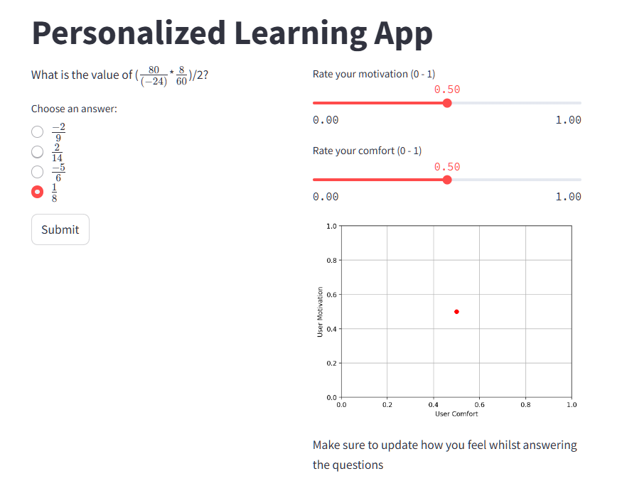

# altREU-project

Personalized Mathematics Learning Application: It randomly generates and organizes a series of questions based on goal skills. The tutor algorithm chooses questions according to your performance and mental state (tracking motivation and comfort through interactable sliders). 
